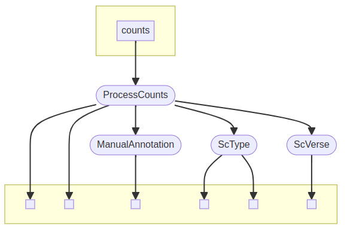

# scMultiAnnotator

## Description

scMultiAnnotator facilitates single-cell annotation according to its [gold standards](https://www.nature.com/articles/s41576-023-00586-w). This Nextflow-orchestrated pipeline implements three annotation algorithms, each using different methodologies:

1. Manual Annotation: Scanpy plots assist the user in manually annotating cell clusters using custom cell markers.

2. Scoring-Based Method: A Python implementation of ScType, which employs its own database of cell markers.

3. Probabilistic Model: Annotates cell types without the need for reference single-cell data, utilising custom cell markers.

Users can provide either `.fastq` files (in which case, `cellranger count` is performed) or a count matrix as input.




## Installation

- Nextflow

    First, install Nextflow in line with its [documentation](https://www.nextflow.io/docs/latest/install.html):

    ```
    # If `java -version` < 11, reinstall Java

    curl -s https://get.sdkman.io | bash
    sdk install java 17.0.10-tem
    java -version
    ```

    ```
    # Install Nextflow

    curl -s https://get.nextflow.io | bash
    chmod +x nextflow
    sudo mv nextflow /usr/local/bin
    nextflow info
    ```

- Docker

    If Docker is not installed yet, follow the steps in [this tutorial](https://docs.docker.com/engine/install/ubuntu/).


## Usage

```
nextflow run leandrotiburske/scMultiAnnotator \
             --fastq ${PWD}/samples.fastq \
             --reference_transcriptome ${PWD}/reference \
             --organism mouse \
             --tissue "Immune system" \
             --markers ${PWD}/markers.csv
```

To see a help message:
```
nextflow run leandrotiburske/scMultiAnnotator --help
```

## Future improvements

Some new features will be introduced in the future to enhance the functionality of this pipeline, including:

1. Process FASTQ files of multiple samples and perform [integration](https://www.sc-best-practices.org/cellular_structure/integration.html);

2. Include even more annotation methodologies (such as reference-based algorithms).